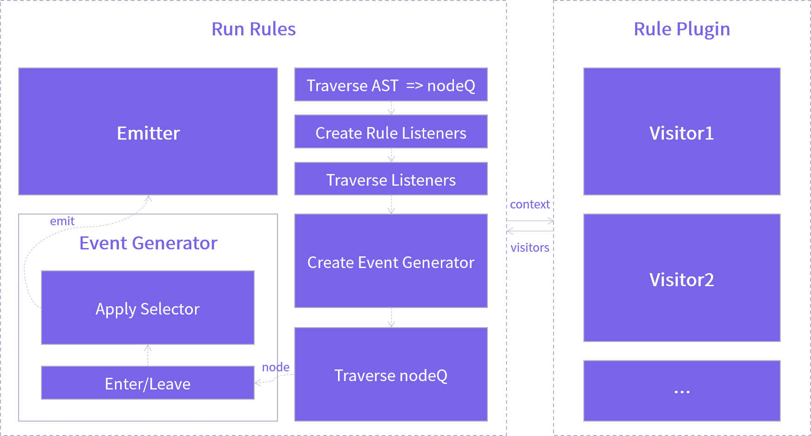
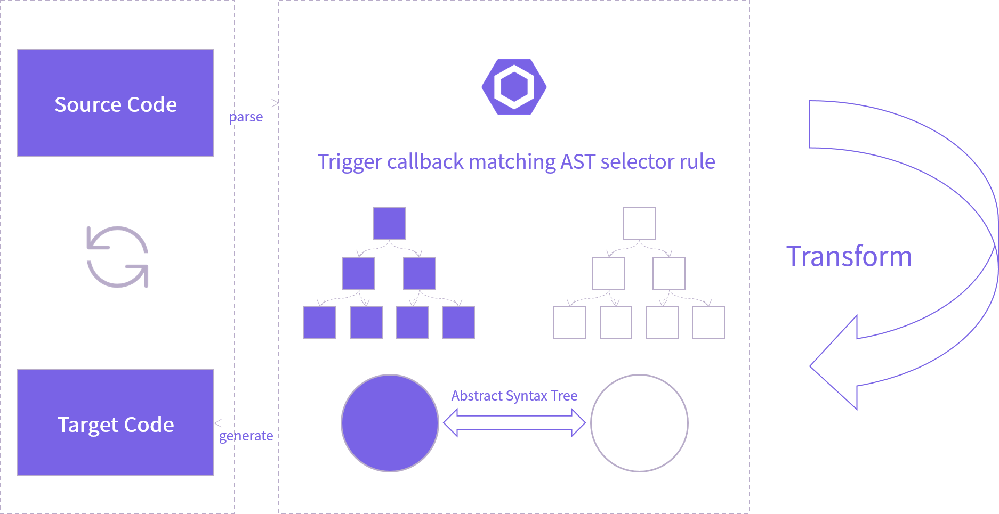

  

# veeui-plugin-sketch

> ESLint Config for Vee UI

## Principle

`ESLint` is designed based on the mechanism of abstract syntax tree (AST) processing. The entire solution architecture is also designed based on the idea of procedural transformation, and uses rule patterns to perform code standardization checks.

The technical selection is based on the `Yeoman` scaffold template generation scheme provided by `ESLint` itself for building.

## License

[MIT](http://opensource.org/licenses/MIT)

Copyright (c) 2023-present VLeeDesignTheory
